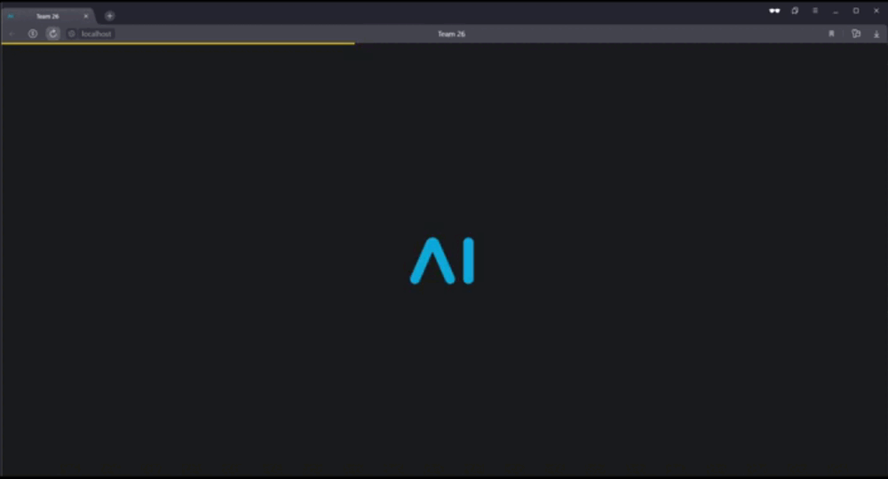

## DL Course - NLP

### How to start

```
docker compose up -d
```

## Architecture


### Web UI




### Experiments results

Удачные эксперименты можно найти в директории experiments

#### CV info agrigation
model                          | GPU    | TIME   | CV info agrigation TIME
-------------------------------|--------|--------|------------------------------------------------------------------------
openchat/openchat_3.5          | 5.7 GB | 12 min | Хорошее определение грейда. Очень лаконично и структурировано описан опыт работы. Ошибочно в опыт работы был выделен университет ИТМО. Хорошо выделены хард скилы. Придумано слишком много неверных софт скиллов. Неплохо описано образование
Intel/neural-chat-7b-v3-1      | 4.3 GB | 8 min  | Хорошее определение грейда. Очень лаконично и структурировано описан опыт работы. Ошибочно в опыт работы был выделен университет ИТМО. Хорошо выделены хард скилы, но попадается немного лишних. Неплохо описаны софт скилы, но попадается немного лишних. Неплохо описано образование

#### Score predict and giving recomendation for improving resume
model                          | GPU     | TIME  | CV info agrigation TIME
-------------------------------|---------|-------|------------------------------------------------------------------------
openchat/openchat_3.5          | > 15 GB | -     | Не хватило памяти
Intel/neural-chat-7b-v3-1      | 14.1 GB | 5 min | Дает полезные рекомендации, Скор хорошо коррелирует со схожестью резюме с вакансией, но разброс скора варьируется не от 0 до 100, как планировалось, а от 40 до 95

### Failed experiments

EleutherAI/gpt-neo-2.7B - Не хватило 12Гб ОЗУ для запуска в коллаб  
openchat/openchat2 - Не хватило 15Гб GPU для запуска в коллаб   
openchat/openchat - Не хватило 15Гб GPU для запуска в коллаб    

mistralai/Mixtral-8x7B-Instruct-v0.1 - Не хватило 15Гб GPU для запуска в коллаб

bigscience/bloom - Не хватило 78Гб SSD для запуска в коллаб